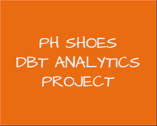
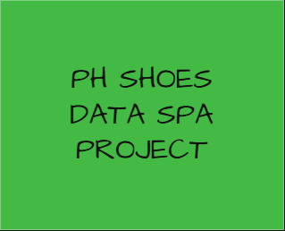
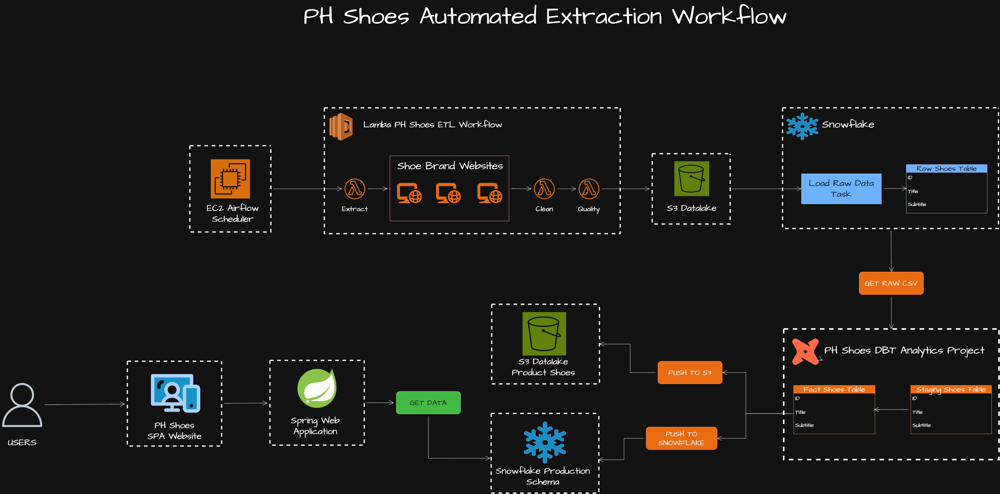

<p align="center">
  <a href="https://github.com/nimbly-dev/ph-shoes-extraction-automation">
    
  </a>
  <a href="https://github.com/nimbly-dev/ph-shoes-dbt-analytics">
    
  </a>
  <a href="https://github.com/nimbly-dev/ph-shoes-data-spa">
    
  </a>
</p>

<p align="center">
  <strong>You are viewing: <code>ph-shoes-extraction-automation</code> repository</strong>
</p>


---

#  Project Structure

```bash
ph-shoes-extraction-automation/
│
├── .github/                 
├── airflow_dags/            
├── deployment/              
├── images/                  
├── lambda/                  
├── scripts/                 
├── terraform-core/          
├── terraform-ec2-airflow/   
└── README.md                
```


##  Directory Breakdown

* **`airflow_dags/`** – Contains the Airflow scheduler and DAGs. These orchestrate the Lambda-based shoe extractors and push collected data into the S3 Data Lake.
* **`deployment/`** – Includes CodeDeploy scripts used to bootstrap and run the Airflow scheduler on EC2 instances.
* **`images/`** – Static images used in `README.md` documentation for visual structure.
* **`lambda/`** – Web scraping logic bundled as Lambda container images (built and deployed to AWS ECS, then run via Lambda).
* **`scripts/`** – Utility scripts used by GitHub Actions for packaging and deployment automation.
* **`terraform-core/`** – Core AWS infrastructure defined in Terraform (S3, IAM, Lambda roles, etc.).
* **`terraform-ec2-airflow/`** – Terraform modules to provision EC2 and deploy the Airflow scheduler.

---

#  PH Shoes Data Workflow Overview

<p align="center">
  
</p>

* **Orchestration**: An EC2-hosted Apache Airflow scheduler triggers scheduled Lambda-based scraping jobs for each brand.
* **ETL Flow**: Lambda functions extract data from brand websites, perform cleaning and quality checks, and upload results to an S3 Data Lake.
* **Loading & Transformation**: Raw files in S3 are loaded into Snowflake's raw schema. dbt then transforms these into clean staging and fact tables via scheduled jobs.
* **Serving Layer**: The transformed data is accessed via a Spring Boot backend and served through a modern SPA (Single Page App) frontend with filtering and AI-powered search capabilities.

This end-to-end workflow ensures automation, scalability, and efficient data access for both analytics and application use.


Got it. Here's a cleaner, structured rewrite that keeps the **explanation-focused tone**, while using bullet points for readability — **not changelog style**, just informative and tight:

---

##  GitHub Actions & Deployment Workflows

This repository uses a set of GitHub Actions to automate core workflows for embedding generation, Lambda deployment, and Airflow EC2 orchestration.


Excellent — here's your finalized **GitHub Actions & Deployment Workflows** section with direct links added to each workflow, keeping your preferred style and tone:

---

## 🚀 GitHub Actions & Deployment Workflows

This repository uses a set of GitHub Actions to automate core workflows for embedding generation, Lambda deployment, and Airflow EC2 orchestration.

###  [Backfill Embeddings](https://github.com/nimbly-dev/ph-shoes-extraction-automation/actions/workflows/backfill_embeddings.yml)

* This workflow generates OpenAI Ada embeddings for products in the `fact_product_shoes` table. These embeddings power the semantic search capabilities on the frontend.
* By default, it runs on the current date (`YEAR`, `MONTH`, `DAY` from env), usually triggered daily.
* You can also run it manually with custom date parameters — useful for backfilling missing embeddings or reprocessing past product drops.


### [Deploy Lambda Image](https://github.com/nimbly-dev/ph-shoes-extraction-automation/actions/workflows/deploy-lambda.yml)

* This workflow builds and pushes the Lambda Docker image that contains the web scraping logic (extractors).
* Once built, it replaces the current image used by the deployed Lambda function.
* It’s triggered manually whenever changes are made to the `lambda/` directory or extractor logic.

###  [Deploy Airflow EC2](https://github.com/nimbly-dev/ph-shoes-extraction-automation/actions/workflows/deploy-airflow.yml)

* This deploys the Airflow scheduler running on EC2.
* It bundles everything inside `/airflow_dags`, builds the image, and deploys it via CodeDeploy.
* If an EC2 instance is already running, this action replaces the scheduler cleanly — no manual intervention needed.

